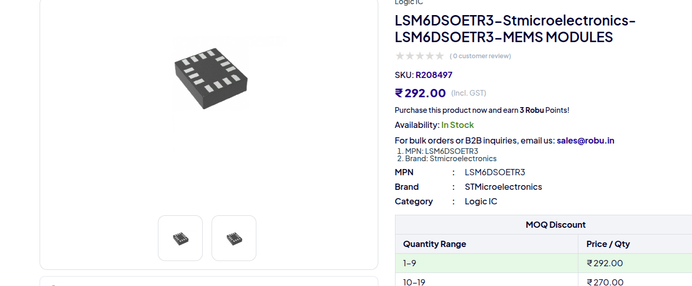

# October 5

After a few days of rumination, my idea for this step counter is finally refined and ready for me to pursue. My inital idea was just a device to tell me how fast I was walking during my exercise, because speed does matter. Incline too. Hence  this idea came. After some thinking I thought of adding some step counting, distance measuring too. 

Now that requried features are there, I needed a cheap and appropriate processor. An arduino nano is too over-powered for this, while a ATtiny13a does not have enough ram. So I researched and found the ATtiny16 series, which has 16KB of flash and 2KB of memory. 

It is perfect for the needed calculations, as well as being simple enough for this project. Some other versionsa re there like the ATtiny8 series, but the RAM is not enough in some cases, and in others the price is more than this ATtiny1624. 

It has I2C, which means I can eaisly use peripherals. I wanted to use an I2C OLED screen for output, hence this is perfect. 

To measure all speed, steps, and distance, I need an IMU or an Intertial Meausrment Unit. For this project I need a 6-axis IMU, meaning a 3-axis accelerometer as well as a 3-axis gyroscope. The cheapest one I could find was the LSM6DS series: 

For some weird reason, IMUs are insanely expensive. Tough to find a cheap one thats 6-axis. This one is LGA, which I have never soldered before, so this will be a new challenge for me. 

Next I will do the schematics and then build pcb. After that I need funding to order parts and PCB, then I can build this project and use it. The plan is pretty clear, and im aching to execute it. 

**Total time spent: 1 hour**
