# October 5

After a few days of rumination, my idea for this step counter is finally refined and ready for me to pursue. My inital idea was just a device to tell me how fast I was walking during my exercise, because speed does matter. Incline too. Hence  this idea came. After some thinking I thought of adding some step counting, distance measuring too. 

Now that requried features are there, I needed a cheap and appropriate processor. An arduino nano is too over-powered for this, while a ATtiny13a does not have enough ram. So I researched and found the ATtiny16 series, which has 16KB of flash and 2KB of memory. 

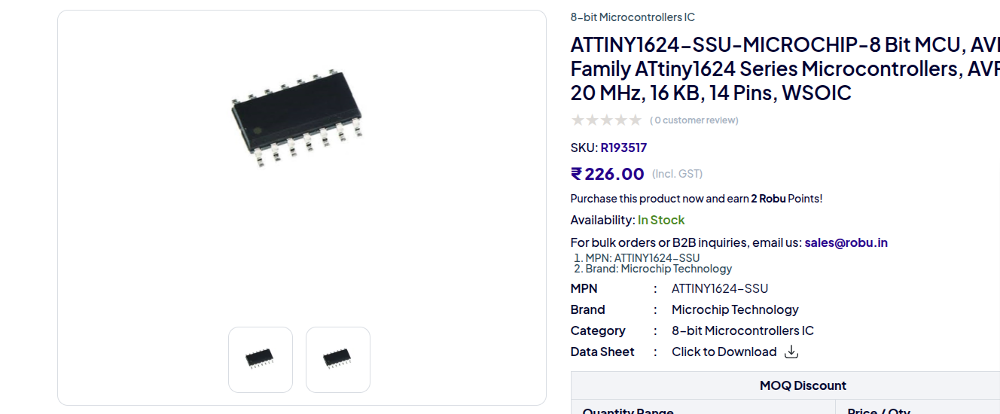

It is perfect for the needed calculations, as well as being simple enough for this project. Some other versionsa re there like the ATtiny8 series, but the RAM is not enough in some cases, and in others the price is more than this ATtiny1624. 

It has I2C, which means I can eaisly use peripherals. I wanted to use an I2C OLED screen for output, hence this is perfect. 

To measure all speed, steps, and distance, I need an IMU or an Intertial Meausrment Unit. For this project I need a 6-axis IMU, meaning a 3-axis accelerometer as well as a 3-axis gyroscope. The cheapest one I could find was the LSM6DS series: 

For some weird reason, IMUs are insanely expensive. Tough to find a cheap one thats 6-axis. This one is LGA, which I have never soldered before, so this will be a new challenge for me. 

Next I will do the schematics and then build pcb. After that I need funding to order parts and PCB, then I can build this project and use it. The plan is pretty clear, and im aching to execute it. 

Note: I did not know i needed a Lapse timelapse for research, so there is no lapse for this. 

**Total time spent: 1 hour**

# October 6

## Making schematics

Today I made the schematic for the device. I thought it wouldn't be that much of a hassle, but it was nonetheless. I forgot i needed a power circuit, because i thought everything would work off of a LiPo, and also realised there were so many pins on the ATtiny going to waste. 

Here is the schematic right now: 

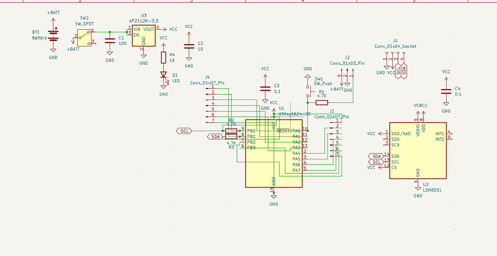

In the top left corner is a simple standard power circuit: 

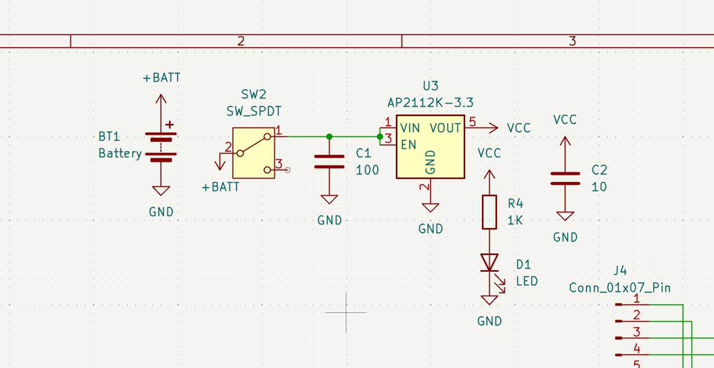

I am using an AP2112K-3.3V LDO to step down the battery voltage to 3.3V. Along with this is a switch, some capacitors and a status LED. 
Had to add this because the IMU will no work off the battery directly, too high of a voltage. 

Next i added schematics for the ATtiny1624:

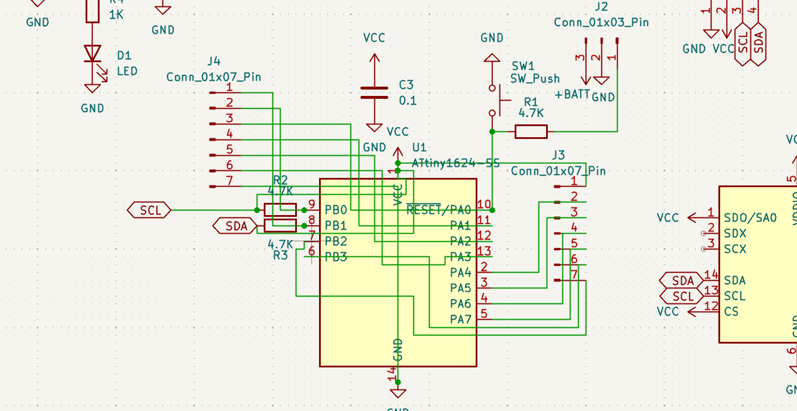

Wired up a reset button, a programming header, the I2C lines for OLED and IMU. Added resistors for the I2C and UPDI programming. I also added some breakout pins because it felt like the rest of the chip was going to waste when im using just 2 pins to drive peripherals. so an optional breakout is there now. Hence the mess of wires. 

Finally schematics for the IMU: 

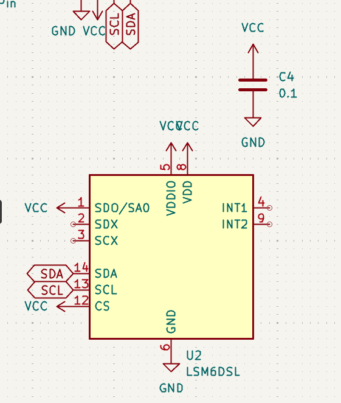

Just two I2C pins, and every other connection is pulled high for the correct setup. 

Thats about it for the schematic, ill make the PCB next

Lapse: https://lapse.hackclub.com/timelapse/I2aO08c73dfr

**Total time spent: 1 hour**

# October 7

## Designing PCB

I designed the PCB today. It tooke me a while to design this because I had to really do a lot of space management. For the current deisgn I am 'satisfied' but I think it can be better. I only made it single sided so i can solder it usign just my hotplate; no double side hassle even thought double might have been easier to design. 
Here is the PCB:
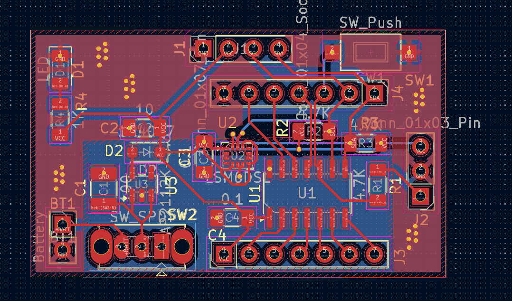
Added a few parts like a switch, to turn the device on and off. 

I also added a diode:
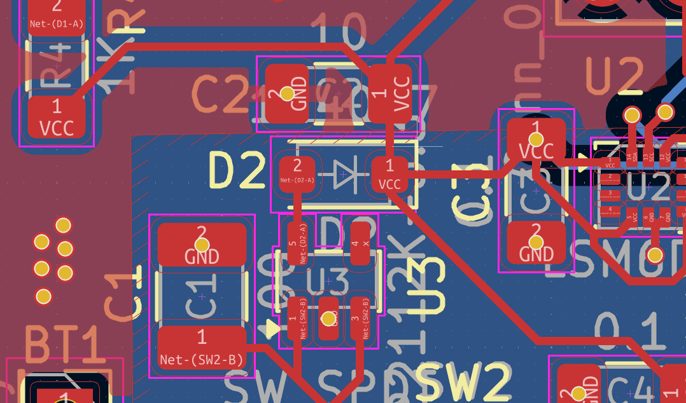

this diode prevents current from entering the LDO in reverse when it's powered by the programmer on the programmign header. 
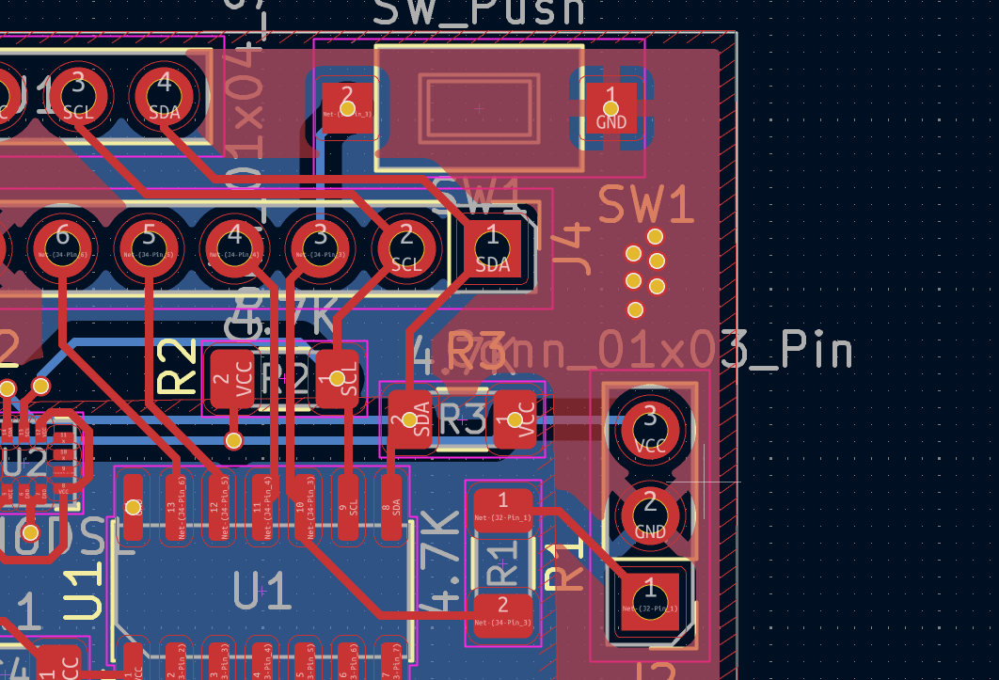
The right three-pin is the programming header, the top button is a reset button for the ATtiny. Up there is a four-pin for the OLED screen. 

The most annoyign part was wiring the I2C lines. I had to route them from the back which was annoying and felt asymmetrical. 
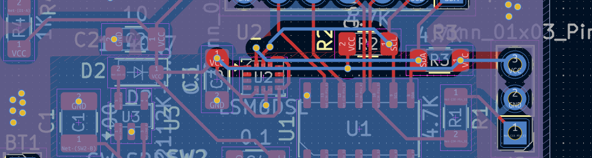
As you can see, where blue is backside. 

Another annoying thing was power VCC connections. I couldnt use a power plane because ground plane more important, and frontside there is no place for a power plane. I actually had to remove a rectangle of the ground plane because it had thin parts which would only capture noise instead of remove it. 

A key thing which i did was to center the IMU. This is important for accurate angle readings and measuring acceleration. I did this by measuring the board dimensions and approximately halving them, and putting guides. 

Here is a 3d view: 
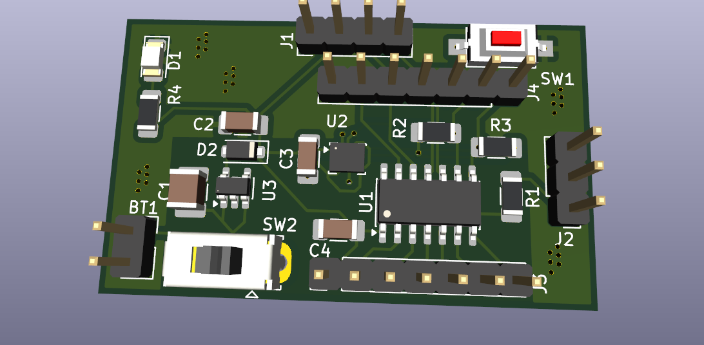
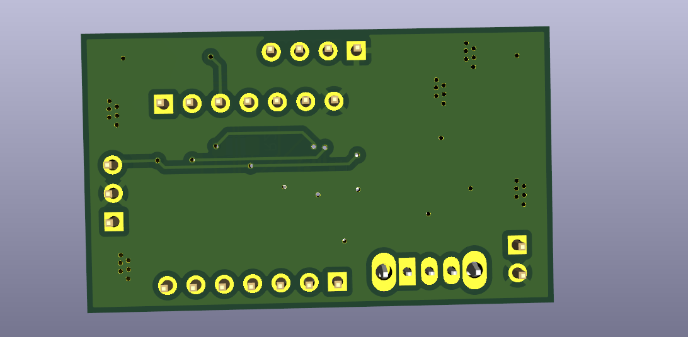

Next is refining PCB, panelising for efficient fabrication, and then repo updating and shipping. 

Lapse: https://lapse.hackclub.com/timelapse/N_VsGccL-1x6

**Total time spent: 1.5 hours**

# October 8

  ## Fixing the PCB

I was looking over the PCB for some time, and there were a few crucial mistakes i had to fix, and i made the PCB smaller. I am actually happy with this design now, it looks much better than before. 
### Mistake 1: breakout pin placement
Before, the breakout pin placements were almost random. the two rows were not aligned with 2.54mm pitch standard. So i had to use another header row as a guide and arrange them. This meant i hd to brign the top one closer, so i had to rearrnage the I2C resistors. Now it is alligned!.

### Mistake 2: UPDI programming pins
I didnt realise UPDI programming puts a resistor only on the Tx, so i had placed a resistor in series with the UPDI pin itslef! It would have been impossible to program the chip if i had done that. I fixed it now by editing the schematics and adding Tx Rx pins, and adding a resistor to only the Tx.
 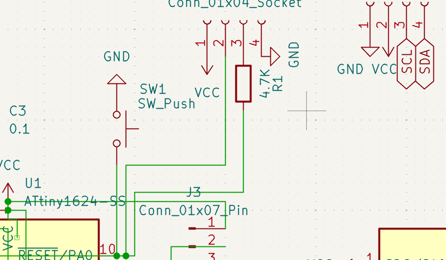

### other edits
i resized the board to be smaller heightwise, because it just felt like a waste of space. I rearrnaged eveyrthing, i recentred the IMU, this time with much better accuracy. 
I added a mode select button to pin 6 on the attiny, so that it can be controlled a little. 
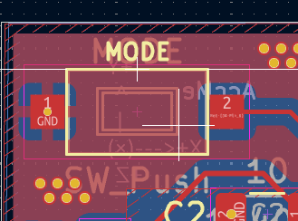

it looks really nice now, especially because i labelled everything on the PCB. I added a accelrometer direction diagram too, some pin names and other things for usability and readability. Most importantly i added labels for battery input; reverse polarity would kill everything. 
 take a look at the updated PCB!

 front:
  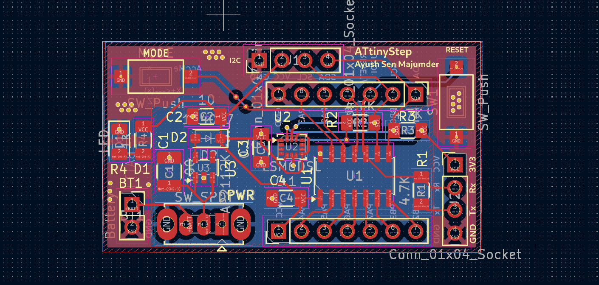
  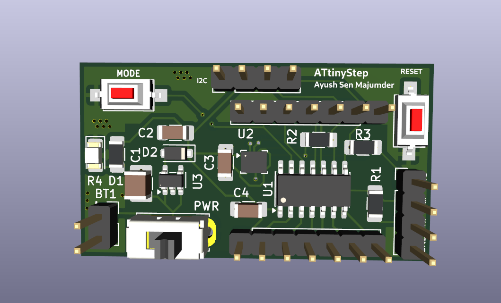
 
 back:
  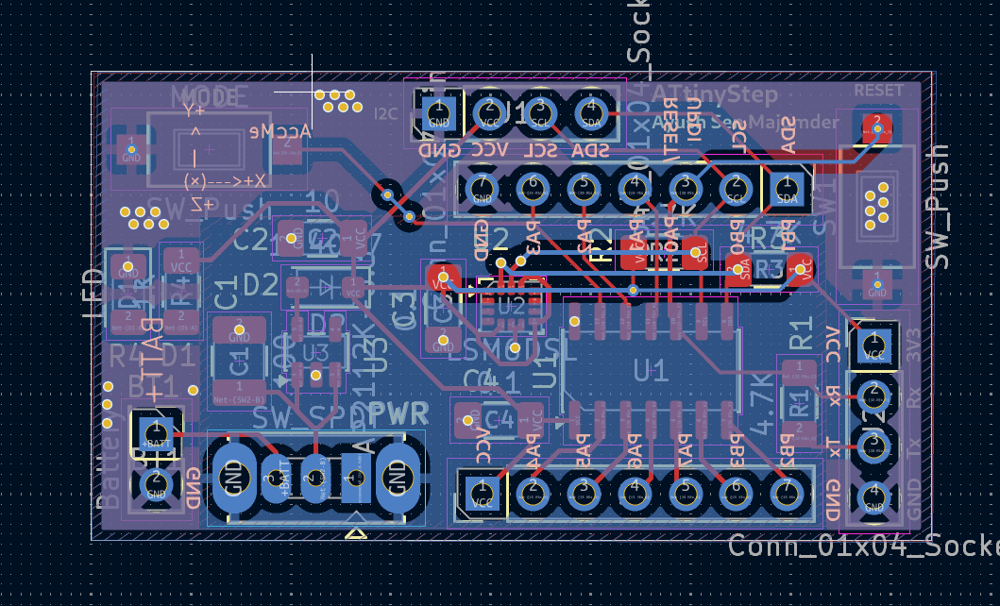
  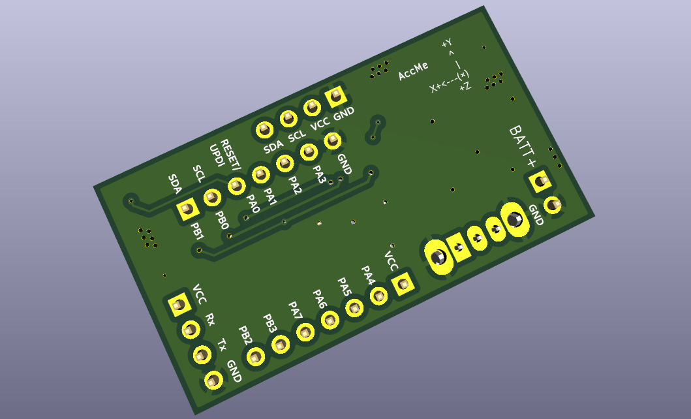

 I am really happy with this. Of course i will do another check before fabrication. But right now its beutiful. 

 Lapse: https://lapse.hackclub.com/timelapse/U3Mb4CTaFlST

 **Total time spent: 1.5 hours**

 # October 9
  ## Project is shipped on GitHub!
  I finally shipped the project on github. The BOM and everything is there i made BOM i made readme. Im too sleepy to write anything now. Hackatime and Lapse tracked me, but the README was also tracked by Hackatime at same time as Lapse. so ill deflate my jorunal time here so that the hackatime time is accurate and im not overstating time. 

  Here is the repo now:
  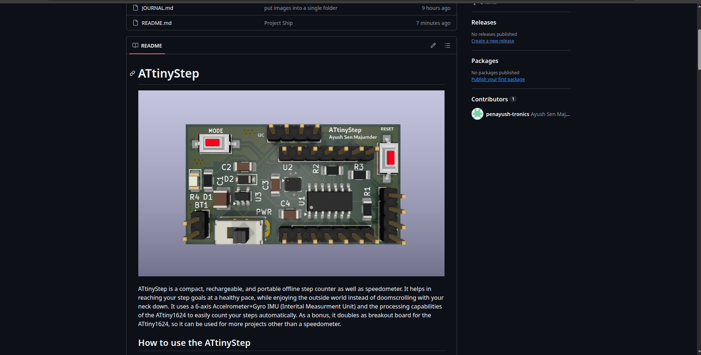

   I added how to use:
   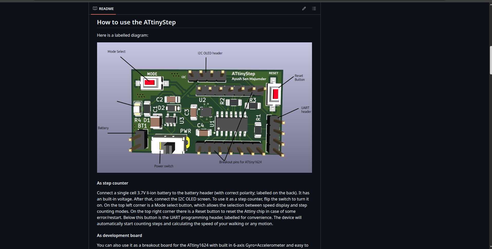

   BOM:
   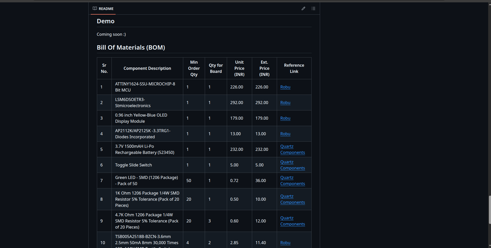

   Lapse: https://lapse.hackclub.com/timelapse/evV-MM8G5bpx

   So i have 2h on lapse and 1h 24 min on hackatime for README. so 1.5h hackatime 0.5h journal rounded roughly.

   **Total time spent: 0.5 hours**