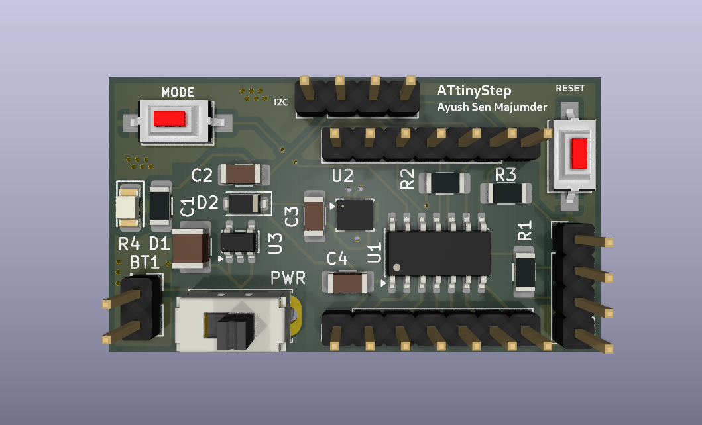
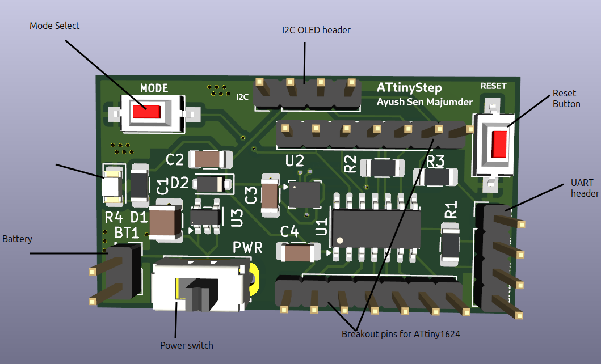
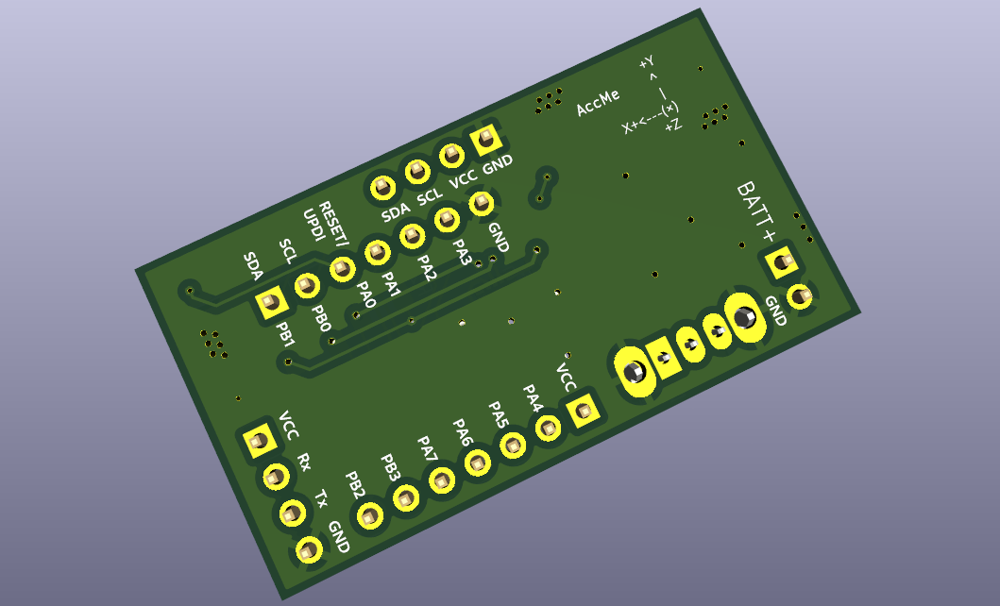
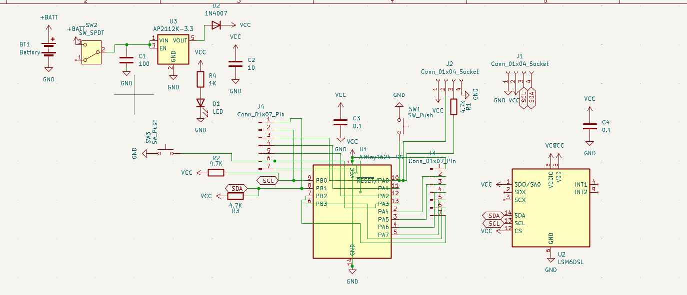

# ATtinyStep

ATtinyStep is a compact, rechargeable, and portable offline step counter as well as speedometer. It helps in reaching your step goals at a healthy pace, while enjoying the outside world instead of doomscrolling with your neck down. It uses a 6-axis Accelrometer+Gyro IMU (Interital Measurment Unit) and the processing capabilities of the ATtiny1624 to easily count your steps automatically. As a bonus, it doubles as breakout board for the ATtiny1624, so it can be used for more projects other than a speedometer.

## How to use the ATtinyStep
Here is a labelled diagram:

#### As step counter
Connect a single cell 3.7V li-ion battery to the battery header (with correct polarity; labelled on the back). It has an built-in voltage. After that, connect the I2C OLED screen. To use it as a step counter, flip the switch to turn it on. 
On the top left corner is a Mode select button, which allows the selection between speed display and step counting modes.
On the top right corner there is a Reset button to reset the Attiny chip in case of some error/restart. Below this button is the UART programming header, labelled for convenience. 
The device will automatically start counting steps and calculating the speed of your walking or any motion. 

#### As development board
You can also use it as a breakout board for the ATtiny1624 with built in 6-axis Gyro+Accelerometer and easy to use I2C header.
When powering it as a development board, make sure to use only **3V3 power (3.3V)**, on the VCC pin either on the breakout pins, the programming header, or the I2C header. Make sure to connect GND-Ground too. **Be careful with polarity**.
Pins 8 and 9 are always pulled high due to the I2C, so use them primarily for I2C. 
Pin 13 is connected to the onboard Mode Select button, using active low. This pin can be reconfigured.
Use the reset button to restart the Attiny1624.

#### Programming
ATtinyStep uses UPDI programming for the ATtiny1624, via UART. Make sure to use 3V3 only.
An appropriate resistor is already placed in series with Tx, so an external series resistor is not required, only a UART to USB converter is needed for programming. 
Connect the GND VCC pins, and connect **UART-USB Rx to ATtinyStep Tx, and Tx to Rx, like cris-cross**.
After that it can be programmed using ArduinoIDE with the **MegaTinyCore board library**.   

### Labels

The board is thoroughly labelled with all components and pins labelled.
Here you can see the breakout pin labels, header labels, battery label **-- PLEASE DONT PUT REVERSE POLARITY--** , and accelerometer direction label.
Use these as a guide for usage. 

## How does it work
The ATinyStep works by letting the ATtiny1624 continuously gather angular orientation and acceleration data. By comparing these continuous values to known patterns, such as walking with it in your hand or pocket, it can accuratley detect a step. These actions create very specific accelration and rotation patterns, hence they can be used as reference. For example, walking with it in your hand will result in a big arc-like path, with maximum acceleration at the edges of the arc, and least in the center. This also is how your mobile device, like a phone, counts steps. The sensor being used here is from the LSM6DS series by STMicroelectronics, where the 6 stands for 6-axis. Six-axis means three-axis accelrometer and three-axis gyroscope. 

## Schematics 

KiCAD schematics can be found [here](PCB_Files/ATtinyStep.kicad_sch)

## PCB design

#### Front side:

#### Back side:

KiCAD PCB design can be found [here](PCB_Files/ATtinyStep.kicad_pcb).
Gerber files for fabrication are [here](PCB_Files/ATtinyStep-Gerbers.zip).
Position file for pick and place is [here](PCB_Files/ATtinyStep-all.pos).

## Why ATtinyStep exists
One day I was walking around my community and talking to my friend online. We were talking about walking as an exercise, and how walking faster is important. Hence, they said that they were sure I wasn't walking fast enough. I told them I walk at 6km/h, but they did not believe me. That day I had two realisations: I should take a break from my phone during walks, and I need a speedometer for myself. So, this idea was born. An offline hardware speedometer. So I can make sure I am walking at a healthy speed.
The name comes from when I was thinking about a title, and realised ATtiny sounds like 'A tiny', and well it's a step counter. So ATtinyStep came. It is pronounced 'Ay Tee tiny step' or just 'A tiny step'.

The extra breakout board pins were because it felt like a waste to have so many pins unused. So the breakout enables them to be used. 

## Demo
Coming soon :)

## Bill Of Materials (BOM)

| Sr No. | Component Description | Min Order Qty | Qty for Board | Unit Price (INR) | Ext. Price (INR) | Reference Link |
|---|---|---|---|---|---|---|
| 1 | ATTINY1624-SSU-MICROCHIP-8 Bit MCU | 1 | 1 | 226.00 | 226.00 | [Robu](https://robu.in/product/attiny1624-ssu-microchip-8-bit-mcu-avr-family-attiny1624-series-microcontrollers-avr-20-mhz-16-kb-14-pins-wsoic/) |
| 2 | LSM6DSOETR3-Stmicroelectronics | 1 | 1 | 292.00 | 292.00 | [Robu](https://robu.in/product/lsm6dsoetr3-stmicroelectronics-lsm6dsoetr3-mems-modules/) |
| 3 | 0.96 inch Yellow-Blue OLED Display Module | 1 | 1 | 179.00 | 179.00 | [Robu](https://robu.in/product/0-96-inch-yellow-yellow-blue-oled-lcd-led-display-module/) |
| 4 | AP2112K/AP2125K -3.3TRG1-Diodes Incorporated | 1 | 1 | 13.00 | 13.00 | [Robu](https://robu.in/product/ap2125k-3-3trg1-diodes-incorporated-300ma-65db-fixed-3-3v-positive-9v-sot-23-5-voltage-regulators-linear-low-drop-out-ldo-regulators-rohs/) |
| 5 | 3.7V 1500mAH Li-Po Rechargeable Battery (523450) | 1 | 1 | 232.00 | 232.00 | [Quartz Components](https://quartzcomponents.com/products/3-7v-1500mah-li-po-rechargeable-battery-523450?variant=44853316813034) |
| 6 | Toggle Slide Switch | 1 | 1 | 5.00 | 5.00 | [Quartz Components](https://quartzcomponents.com/products/toggle-slide-switch?variant=31898088833159) |
| 7 | Green LED - SMD (1206 Package) - Pack of 50 | 50 | 1 | 0.72 | 36.00 | [Quartz Components](https://quartzcomponents.com/collections/all/products/green-led-smd-1206-package-pack-of-50) |
| 8 | 1K Ohm 1206 Package 1/4W SMD Resistor 5% Tolerance (Pack of 20 Pieces) | 20 | 1 | 0.50 | 10.00 | [Quartz Components](https://quartzcomponents.com/products/1k-ohm-1206-package-1-4w-smd-resistor-5-tolerance-pack-of-20-pieces?variant=44679699792106) |
| 9 | 4.7K Ohm 1206 Package 1/4W SMD Resistor 5% Tolerance (Pack of 20 Pieces) | 20 | 3 | 0.60 | 12.00 | [Quartz Components](https://quartzcomponents.com/products/4-7k-ohm-1206-package-1-4w-smd-resistor-5-tolerance-pack-of-20-pieces?variant=44679719878890) |
| 10 | TSB005A2518B-BZCN-3.6mm 2.5mm 50mA 8mm 30,000 Times 180gf 12V SMD Tactile Switches | 4 | 2 | 2.85 | 11.40 | [Robu](https://robu.in/product/tsb005a2518b-bzcn-3-6mm-2-5mm-50ma-8mm-30000-times-180gf-12v-smd-tactile-switches-rohs/) |
| 11 | A7 / 1N4007 SMD Diode (Pack of 10) | 10 | 1 | 1.10 | 11.00 | [Quartz Components](https://quartzcomponents.com/products/m7-1n4007-smd-diode-pack-of-11?variant=43690452713706) |
| 12 | 100nF / 0.1uF (104) 50V 1206 SMD Capacitor (Pack of 10 Pieces) | 10 | 2 | 1.60 | 16.00 | [Quartz Components](https://quartzcomponents.com/products/100nf-0-1uf-104-50v-1206-smd-capacitor-pack-of-10-pieces?variant=43526822232298) |
| 13 | 16V 10uF X5R 1206 Multilayer Ceramic Capacitors MLCC | 3 | 2 | 4.57 | 13.71 | [Robu](https://robu.in/product/cl31a106kohnnwe-samsang-16v-10uf-x5r-1206-multilayer-ceramic-capacitors-mlcc-smd-smt-rohs/) |
| 14 | MLCC SMD Capacitor - 100UF, 10V, 1210 | 1 | 1 | 46.00 | 46.00 | [Robu](https://robu.in/product/lmk325abj107mm-p-taiyo-yuden-cap-smd-mlcc-100uf-10v-1210-pack-of-1/) |
| 15 | TP4056 - Battery Charging | 1 | 1 | 14.00 | 14.00 | [Quartz Components](https://quartzcomponents.com/products/tp4056-battery-charging-micro-usb) |
| 16 | Male/Female headers | 1 | 1 | 9.00 | 9.00 | [Robu](https://robu.in/product/2-54mm-1x40-pin-male-single-row-straight-short-header-strip-pack-of-3/) |
| 17 | Custom PCB | 5 | 1 | 188.80 | 944.00 | [Lion Circuits](https://www.lioncircuits.com/quote?layers=2&units=5&dimensionX=50&dimensionY=20) |
|  | Totals: |  | 22 | 1226.96 | 2070.11 |  |

Price per board: ~1230 INR or ~ $12.9 USD

The spreadsheet BOM is [here](ATtinyStepBOM.xlsx)

